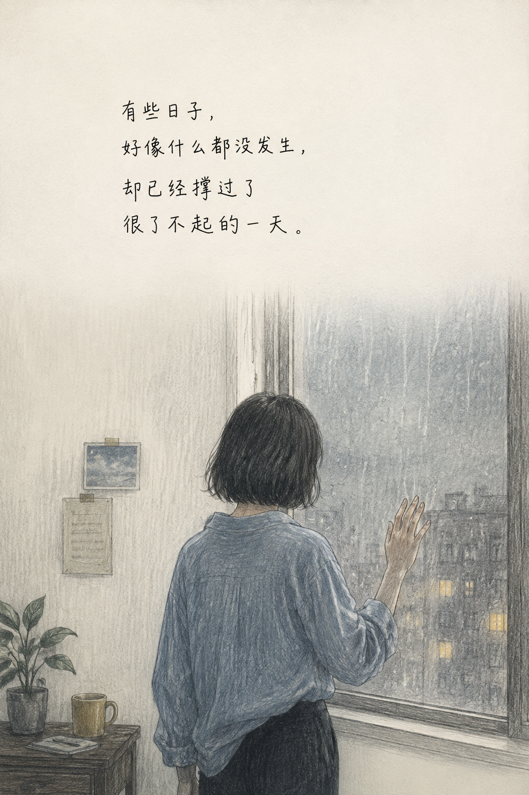
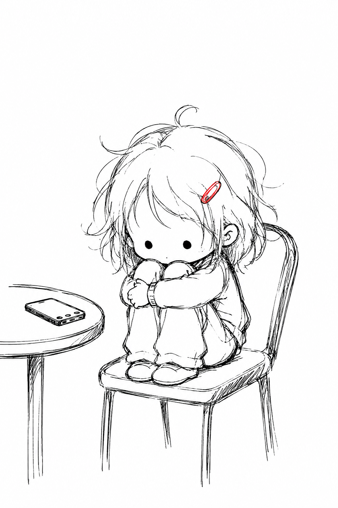

# baicat

> 一个**图文故事重构 + 双风格条漫生成器** Agent Skill。先用叙事前置流程（核心诊断→定结局→编排并锁视觉基调）把故事想透、视觉基调定好，再直接出图，拼装成可浏览的 HTML 图文故事页。默认**彩铅治愈**，明确说"涂鸦"才切黑白丧系。

[](LICENSE)

## 这是什么

抖音上"画一个故事"风格的手绘条漫很受欢迎，但每次都要手动拆故事、反复纠结结局、再逐张生图排版，流程碎且重复。

**baicat 现已合并「观众介入图文故事」**，把"如何讲一个有停留、代入与讨论势能的故事"和"如何出图"沉淀成一个 Skill，四阶段手动推进：

1. **核心诊断** — 只挖出故事核心 + 异常封面句，不铺一堆字段；
2. **结局设置** — 五种结局选一（真相反转/反常选择/余震定格/开放留白/立场句）；
3. **图文编排** — 逐格拆分镜，**同步锁定彩铅的色调/质感/光晕**（光影+画纸序号），一次定型不返工；
4. **彩铅生图** — 把分镜 + 锁定的视觉基调喂给脚本直接出图。

分阶段手动推进，每阶段做完即停、等确认，不抢跑。

## 两种风格

| 中文名 | 英文名 | 调性 | 触发 |
|--------|--------|------|------|
| **彩铅（默认）** | `colored-pencil` | 低饱和高级灰，铅笔排线，真实比例，治愈克制 | 默认；或说"彩铅/彩色铅笔/治愈条漫" |
| **涂鸦** | `doodle` | 黑白线稿 + 唯一红色点缀，Q版简笔，丧系自嘲 | 明确强调"涂鸦/黑白涂鸦/丧系涂鸦" |

**默认彩铅直接出图**；只有明确强调"涂鸦"才切涂鸦。

| | |
|:---:|:---:|
| <br>**彩铅** colored-pencil<br>低饱和高级灰，铅笔排线，治愈克制 | <br>**涂鸦** doodle<br>黑白线稿 + 红色点缀，Q版简笔 |

## 工作流（四阶段手动推进）

> 每完成一阶段必须停下，等用户输入【继续】。禁止连续跳阶段。

1. **阶段1 核心诊断**：只输出「故事核心」+「异常封面句」两样，附 A/B/C/D 判定。
2. **阶段2 结局设置**：主情绪 + 五种结局选一 + 收尾画面，附 3 行极简确认清单。
3. **阶段3 图文编排**：先定视觉基调（光影#N/画纸#N，全篇统一），再逐格拆画面；text 即最终旁白（两风格生图均不画字，后期自加）；>6格且彩铅 → 启用双分镜。
4. **阶段4 彩铅生图**：

```bash
python3 scripts/generate_story.py \
  --story-json story.json \
  --output-dir ./output \
  --style colored-pencil
```

故事 JSON 格式：
```json
{
  "title": "等",
  "style": "colored-pencil",
  "lighting": 3,
  "paper": 1,
  "split2": true,
  "anchor": "optional/path/anchor.png",
  "panels": [
    {"id": "p1", "scene": "A girl sitting on a chair hugging knees, quietly waiting.", "text": "等一个人。"}
  ]
}
```

- `lighting`（1-6）/ `paper`（1-5）：**阶段3已锁定**；不填由脚本按情绪自动推断 / 跨篇轮换（抗同质化）。
- `split2`：彩铅且总格数>6 时，第1格作封面单图，其余两两拼成 3:4 双分镜（极淡浅灰细线，禁粗黑边框）。
- `multipanel`（配 `"multipanel_cover": false`、`"multipanel_style": "free|regular"`）：整页多格模式，
  一张 3:4 图装 3-5 格，超 5 格自动拆页。
- `page_native`（配 multipanel）：**整页原生生图**——不逐格生成拼接，把全页 scene 合并成
  PAGE LAYOUT 描述，一次调用 GPT 画出整页（上大格+中排小格+下大格、白边留白分隔）。
  产物只有 `story_page_<n>.jpeg`，无分镜单元。拼接版有扁长格裁切风险，长镜头故事推荐 page_native。
- `anchor`：画风锚点图，锁多格画风一致；不填则第2格起用上一格输出参考。
- `text`：两风格生图均**不画字**，仅作后期加字依据 + 彩铅光影情绪推断，生图只留顶部约1/3大留白区。

## 抗同质化

- 光影 6 套 + 画纸 5 套变量（存 `STYLES.md`），同一篇锁一套、跨篇轮换，组合记录进 `USAGE.json`。
- 出图后用醒图做人工痕迹二次加工（`references/抗同质化手工流程.md`），每篇回填 `references/数据复盘表.md`。

## 用法示例

对 AI Agent 说：

```
帮我做一篇图文故事：一个单亲妈妈深夜加班，孩子等不到她睡着在楼道
```

```
用彩铅风格，画"等一个人"的故事
```

```
用涂鸦风格做个漫画
```

## 配方驱动 & 画风一致性

- **配方驱动**：画风 prompt 存 `STYLES.md`，脚本只提取配方 + 填占位符，禁止手工缩写或同义改写。新增画风只需在 `STYLES.md` 加一段配方。
- **多格一致**：`anchor` 锚点图机制锁定连续分镜画风统一；未指定时第2格起用上一格输出作参考。

## 环境变量

| 变量 | 用途 |
|------|------|
| `IMAGE_API_URL` | 生图 API 地址（如 `https://host/v1`） |
| `OPENAI_API_KEY` | API 密钥 |

`IMAGE_API_URL` 未设时，脚本可改用 `minis-model-use run --model gpt-image-2 --endpoint images-gen` 路线。

## 目录结构

```
baicat/
├── README.md                      # 本文件
├── SKILL.md                       # Skill 指令（四阶段叙事流程 + 风格定义 + 生成工作流 + 约束）
├── STYLES.md                      # 画风配方库 + 光影/画纸变量库（加画风只改这里）
├── LICENSE
├── scripts/
│   └── generate_story.py          # 配方驱动批量生图脚本（支持 lighting/paper/split2）
├── templates/
│   └── story_page.html            # 图文故事 HTML 模板
├── references/
│   ├── 抗同质化手工流程.md          # 醒图二次加工 SOP
│   └── 数据复盘表.md               # 发布数据复盘
└── examples/
    ├── style-colored-pencil.png
    └── style-doodle.png
```

## 接入方式

```bash
git clone https://github.com/feeling6667/baicat.git
```
放到 skills 目录（如 `/var/minis/skills/baicat/`），Agent 自动识别 `SKILL.md`。

## 设计原则

- **先讲透再画**：故事核、结局、视觉基调都在出图前定好，不返工。
- **逻辑优先于效果**：反转/留白/情绪不能让位于逻辑漏洞。
- **直接产出图文成品**：从故事到可浏览 HTML 页面的端到端链路。
- **配方驱动**：画风 prompt 存 `STYLES.md`，脚本不缩写，画风不漂移。
- **留白为主**：生图不画字，顶部约1/3大留白区后期加字，画面上缘淡入留白无硬分界，给情绪留呼吸空间。

## License

[MIT](LICENSE) © feeling6667

minis_url: minis://skills/baicat/README.md
